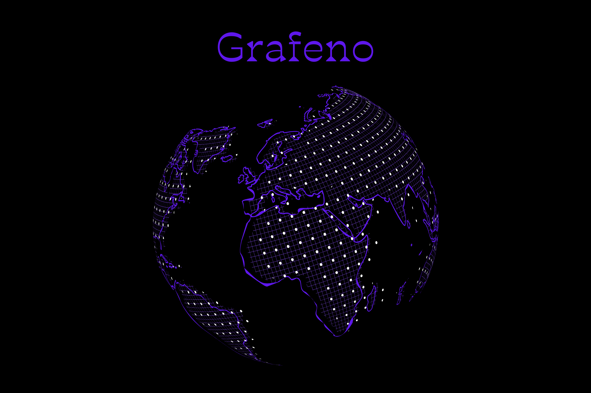

# Introducción



Grafeno es una herramienta de automatización para el despliegue de entornos destinados a retos de **pentesting** y pruebas de penetración. Con Grafeno, tendrás acceso a centenares de desafíos de ciberseguridad, tanto de manera individual como en el marco de los cursos ofrecidos en la plataforma de [`Offensive Skills`](https://offs.es).

> Todos los entornos de prueba se despliegan localmente, lo que te permite realizar pruebas de penetración offline y perfeccionar tus **skills** en **ciberseguridad**.

# Instalación

La instalación de Grafeno es sencilla, ya que únicamente requiere que tengas **Docker** instalado en tu sistema. Se recomienda actualizar tu sistema antes de proceder:

> ***Nota***
> Si  no tienes `docker` instalado, debes ejecutar:
> ```
> sudo ./setup_docker.sh
> ```
>
> O **sigue las instrucciones en [la documentación de Docker](https://docs.docker.com/get-docker/)**.


Lo siguiente es actualizar nuestro repositorio de paquetes
```bash
sudo apt update && sudo apt upgrade -y
```

Instalamos `npm` para el manejo de dependencias e instalación de módulos `node`
```
sudo apt install npm
```

Descargamos la herramienta:
```
git clone https://github.com/Offensive-Skills/Grafeno.git
cd Grafeno/
```

Una vez esta listo, debemos instalar la herramienta:

**Inicializamos el entornos instalando las dependencias**
```
npm install
```


# Ejecución

Para poder ejecutar la herramienta, debemos ejecutar el siguiente comando
```
npm run start
```

> ***Nota Importante***
> Necesitamos tener **credenciales** válidas para poer acceder a Grafeno
> Para poder conseguirlas, solo tendremos que acceder a la página de [Offensive Skills](https://offs.es), [registrarnos](https://offs.es/escritorio), y acceder a la [página de gestión de `API Tokens`](https://offs.es/escritorio/api-token)

Ahora ya estamos preparados para iniciar sesión

**Campos solicitados**:
- `usuario`: es tu nombre de usuario (que has creado en [Offensive Skills](https://offs.es/escritorio))
- `api-token`: es el token asociado a tu cuenta - Encuéntralo en [la página de `API Tokens`](https://offs.es/escritorio/api-token).


# Notas adicionales
- Verifica que Docker esté funcionando correctamente antes de ejecutar Grafeno.
- Al gestionar todas las dependencias a través de Docker, Grafeno garantiza una experiencia homogénea en diferentes sistemas operativos.

---

# License

Grafeno © 2024 by Offensive Skills is licensed under Creative Commons Attribution-NonCommercial-ShareAlike 4.0 International.

Puedes consultar más detalles sobre la licencia en el archivo [`LICENSE`](./LICENSE.md).
